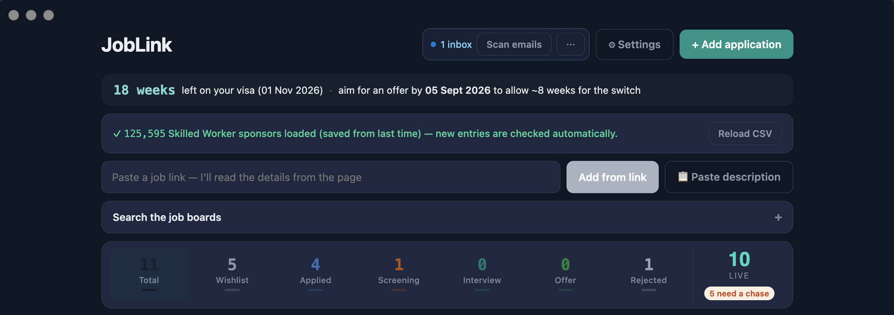
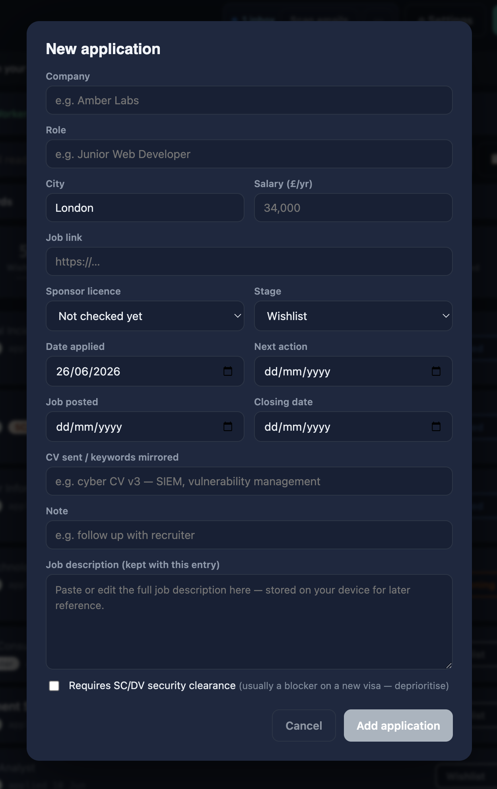
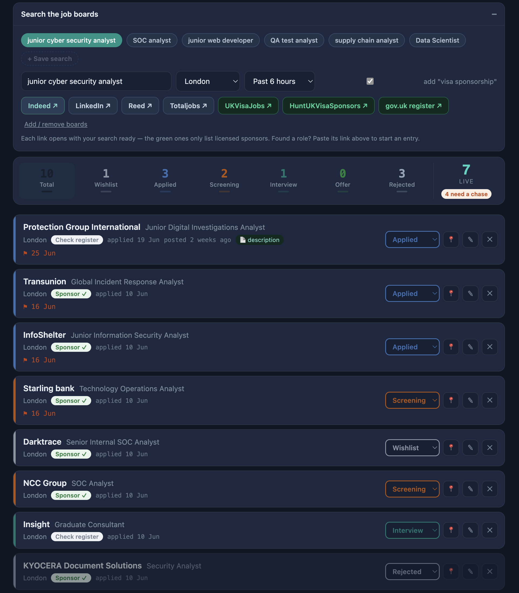
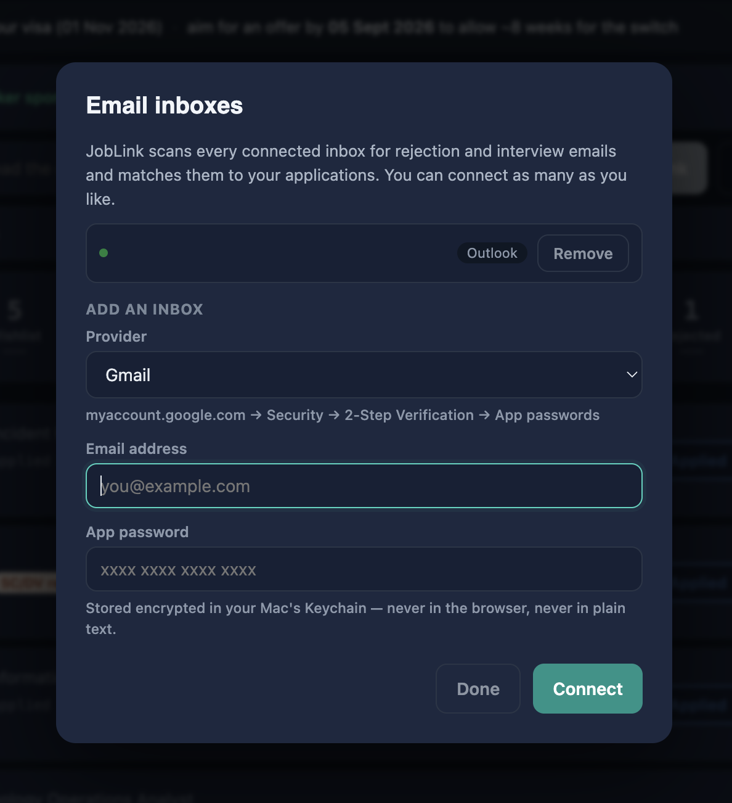

# JobLink

A sponsorship-aware job application tracker, built for UK visa-sponsored job searches —
now a cross-platform desktop app (macOS & Windows) with automatic inbox scanning and
one-paste job capture.

I built this while searching for Skilled Worker–sponsored roles on a Graduate visa.
Generic trackers don't answer the three questions that actually decide whether an
application is worth making: **is the employer a licensed sponsor, does the salary clear
my threshold, and does the role need security clearance?** JobLink answers all three at
the point of entry — and then keeps your whole pipeline (and your inbox) in one place.

## Screenshots

| Dashboard & pipeline | New application |
| --- | --- |
|  |  |

| Sponsor-aware job-board search | Connect multiple inboxes |
| --- | --- |
|  |  |

## Features

### Sponsorship & visa
- **Sponsor register lookup** — load the official gov.uk Register of Licensed Sponsors
  CSV; every company you add is checked automatically, with fuzzy matching for legal vs
  trading names (e.g. "Boots" → "Boots Management Services Limited"). The register is
  remembered between launches (stored in IndexedDB).
- **Salary floor check** — flags whether an advertised salary clears your personal
  Skilled Worker threshold (new-entrant rates supported).
- **Visa countdown** — weeks remaining plus a target offer date that allows ~8 weeks for
  switch processing.
- **Clearance flag** — marks roles requiring SC/DV clearance.

### Capturing jobs
- **Paste a link** — paste a job URL and JobLink reads the page and auto-fills role,
  company, location, salary, date posted and closing date. Uses embedded `JobPosting`
  structured data; LinkedIn is handled via its public guest endpoint. *(Desktop app only —
  needs the main process to fetch pages.)*
- **Paste a description** — paste the full posting text and it extracts role, company,
  city, salary, posting time, closing date and clearance mentions, then keeps the full
  description with the entry.
- **Manual add** — full editor with every field.

### Pipeline
- Applications grouped by stage; overdue follow-ups surfaced first; automatic +7-day chase
  dates when you mark something applied.
- **Pin to top** any application.
- **Editable job-board launcher** — add/remove your own boards (with `{q}` / `{c}` / `{d}`
  tokens), saved between launches. Includes a **date-posted** filter (past 6h / 24h / 48h /
  72h / week) applied automatically to Indeed and LinkedIn.
- **Saved searches** — save and delete reusable role-keyword chips.

### Inbox scanning (desktop app)
- **Connect multiple inboxes at once** — Gmail, Yahoo, iCloud, AOL or any custom IMAP
  server (via an app password), plus Outlook/Microsoft via secure OAuth sign-in.
- **Auto-detects** rejection and interview emails and matches them to your applications,
  suggesting stage changes.
- **Automatic scanning** — runs on launch and on a timer (15 min / 30 min / 1 hour); also
  scannable on demand.
- Credentials are encrypted in the OS keychain (Electron `safeStorage`).

### Privacy
- **Local-first.** Applications, settings and the sponsor register live on your device.
  Email access is read-only and runs entirely on your machine; nothing is sent to any
  server other than your own mail/Microsoft provider.

## Run it (development)

```bash
npm install
npm run electron:dev      # full desktop app, live
# or
npm run dev               # web UI only, at http://localhost:5173
```

## Build the apps

```bash
npm run electron:build:arm   # macOS .dmg (Apple Silicon)  → release/
npm run electron:build:win   # Windows .exe installer       → release/  (run on Windows)
```

On Windows you can also just double-click **`build-windows.bat`**.

> Builds are unsigned, so first launch shows a Gatekeeper (macOS) or SmartScreen (Windows)
> warning — open it once via right-click → Open (Mac) or "More info → Run anyway" (Windows).

## Standalone file

`JobLink.html` is a single self-contained file (React + libraries bundled in, no internet
needed) — double-click to open in any browser. It has everything **except** inbox scanning
and link-fetching, which require the desktop app.

## Outlook setup (optional)

To scan an Outlook/Microsoft inbox, create a free app registration at
portal.azure.com → App registrations:
1. Accounts: "any org + personal".
2. Authentication → Add a platform → **Mobile and desktop applications** → tick
   `http://localhost`; set **Allow public client flows → Yes**.
3. API permissions → Microsoft Graph → Delegated → **Mail.Read**.
4. Paste the **Application (client) ID** into JobLink → Settings.

Gmail / Yahoo / iCloud / AOL just need an **app password** from your account's security
settings (2-step verification must be on).

## Sponsor register data

Download the CSV from gov.uk ("Register of licensed sponsors: workers") and load it via the
button in the app. It updates frequently — refresh it every week or two.

## Stack

React 18 · Vite · Electron · PapaParse · ImapFlow · MSAL
